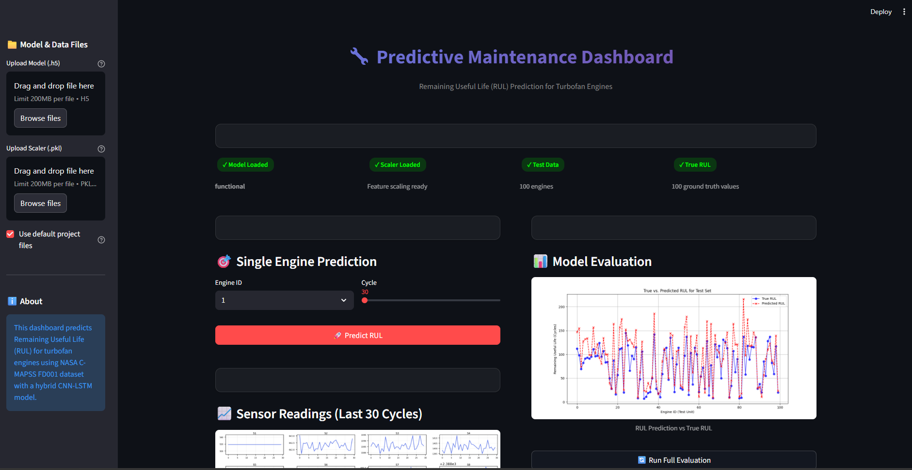
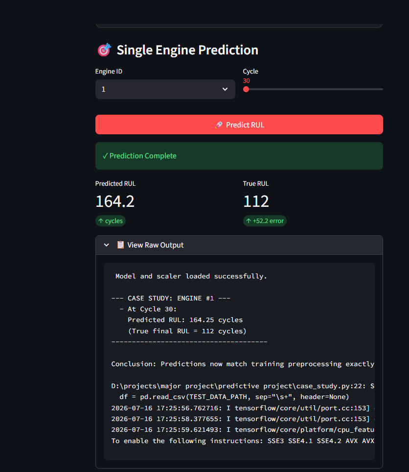
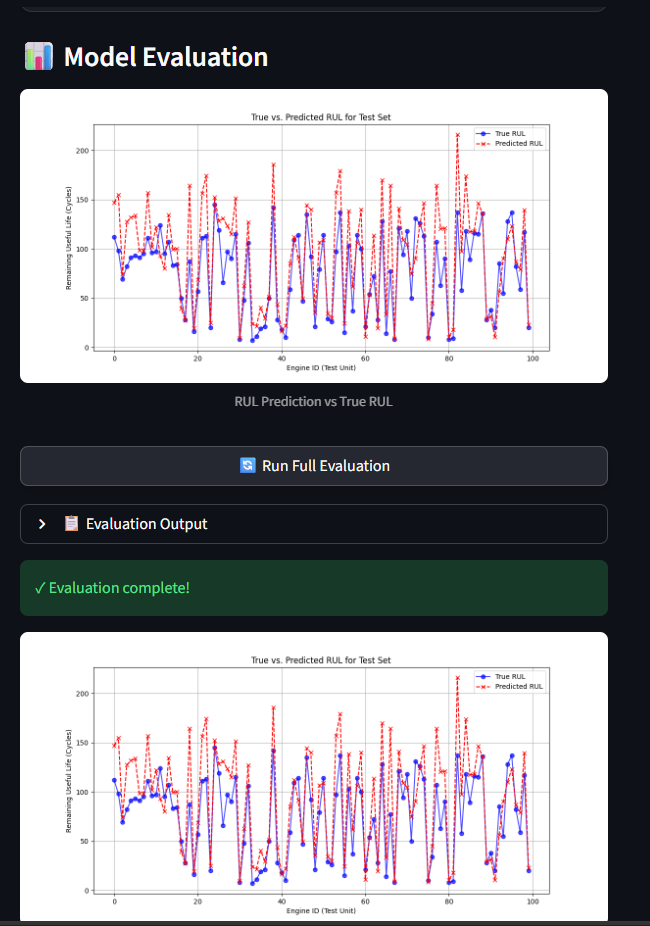
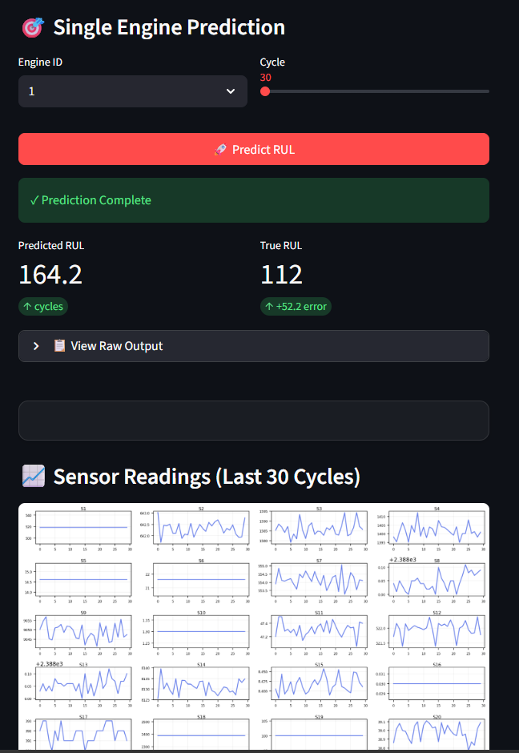
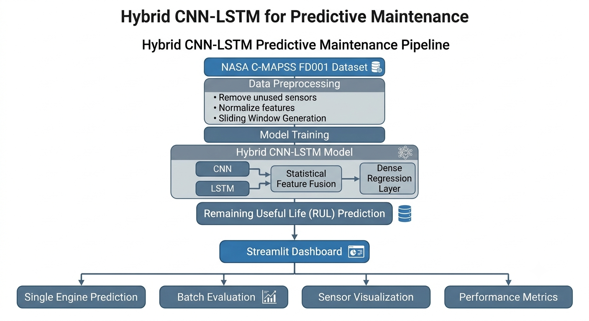

# Hybrid CNN-LSTM for Predictive Maintenance

An end-to-end Predictive Maintenance system that estimates the **Remaining Useful Life (RUL)** of turbofan engines using a **Hybrid CNN-LSTM with Statistical Feature Fusion** trained on the NASA C-MAPSS FD001 dataset.

The project combines deep learning, feature engineering, interactive visualization, and web-based interfaces to provide an end-to-end RUL prediction workflow.

---

# Overview

Unexpected machine failures lead to costly downtime and maintenance expenses.

This project predicts the Remaining Useful Life (RUL) of aircraft turbofan engines using multivariate sensor data and deep learning models.

Unlike traditional implementations, this project includes:

- Hybrid CNN-LSTM Architecture
- Statistical Feature Fusion
- Interactive Streamlit Dashboard
- Model Optimization
- Ablation Study
- Single Engine Prediction
- Batch Evaluation
- Performance Visualization

---

# Dashboard Preview

| | |
| :---: | :---: |
|  |  |
|  |  |

---

# System Architecture

The following diagram illustrates the complete workflow of the proposed Hybrid CNN-LSTM predictive maintenance system, from data preprocessing to Remaining Useful Life (RUL) prediction and interactive visualization through the Streamlit dashboard.



---

# Demo


---

# Key Features

- Hybrid CNN-LSTM Architecture
- Statistical Feature Fusion
- Interactive Streamlit Dashboard
- Upload Custom Model (.h5)
- Upload Custom Scaler (.pkl)
- Single Engine Prediction
- Batch Evaluation
- Sensor Visualization
- Hyperparameter Optimization
- Ablation Study

---

# Project Structure

```
Predictive-Maintenance-LSTM/

│── assets/
│── app_streamlit.py
│── ablation_study.py
│── case_study.py
│── evaluate_model.py
│── hybrid_model.py
│── model_train.py
│── model_optimize.py
│── SlidingWindow.py
│── requirements.txt
│── train_FD001.txt
│── test_FD001.txt
│── RUL_FD001.txt
```

---

## Tech Stack

**Programming Language**
- Python

**Machine Learning**
- TensorFlow
- Keras
- Scikit-learn

**Data Processing**
- NumPy
- Pandas

**Visualization**
- Matplotlib
- Streamlit

---

# Dataset

**NASA C-MAPSS FD001**

The project uses the publicly available NASA Commercial Modular Aero-Propulsion System Simulation (C-MAPSS) dataset for Remaining Useful Life prediction.

---

# Model Architecture

The proposed architecture combines:

- CNN for local feature extraction
- LSTM for temporal sequence learning
- Statistical feature fusion
- Dense regression layers

This hybrid approach improves prediction performance while maintaining lightweight inference suitable for practical predictive maintenance applications.

---

# Dashboard

The dashboard provides:

- Upload trained models (.h5)
- Upload scaler (.pkl)
- Single engine RUL prediction
- Batch evaluation
- Prediction visualization
- Sensor trend analysis
- Performance metrics

---

## Results

The Hybrid CNN-LSTM model was evaluated on the NASA C-MAPSS FD001 dataset.

| Metric | Value |
|--------|------:|
| MAE | 22.91 cycles |
| RMSE | 30.32 cycles |
| R² Score | 0.47 |

The evaluation script loads the trained model (`hybrid_cnn_lstm_model.h5`) and reports prediction performance on the FD001 test set.

---

# Model Comparison

The project includes comparisons between multiple architectures:

- CNN
- LSTM
- CNN-LSTM
- Hybrid CNN-LSTM with Feature Fusion

An ablation study is included to evaluate the contribution of each component.

---

# Installation

Clone the repository

```bash
git clone https://github.com/zoro7204/Predictive-Maintenance-LSTM.git
```

Install dependencies

```bash
pip install -r requirements.txt
```

Run the application

```bash
streamlit run app_streamlit.py
```

---

# Future Improvements

- Transformer-based RUL prediction
- Explainable AI (XAI)
- Real-time IoT integration
- Docker deployment
- Cloud deployment
- Multi-engine monitoring dashboard

---

## Key Learnings

During this project, I gained practical experience in:

- Time-series data preprocessing using sliding window techniques
- Remaining Useful Life (RUL) prediction with the NASA C-MAPSS FD001 dataset
- Designing and training Hybrid CNN-LSTM deep learning models
- Statistical feature fusion for improving prediction performance
- Model evaluation using MAE, RMSE, and R² metrics
- Hyperparameter optimization and ablation studies
- Building an interactive Streamlit dashboard for model inference and visualization
- Managing machine learning models using TensorFlow, Keras, and Scikit-learn

---

# Author

**Veeresh**

- GitHub: https://github.com/zoro7204
- LinkedIn: https://linkedin.com/in/veeresh-k7204

---

# License

This project is licensed under the MIT License.
